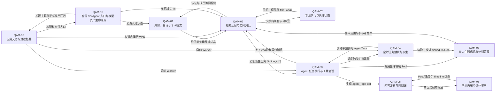

# XOXO Meridian Project Module View

> 证据快照：2026-09-12。本文以当前源码、`package.json`、Prisma schema、迁移、运行脚本和测试为依据。它只定义长期质量责任边界与审查范围，不对当前实现打分，也不把目录结构直接等同于模块结构。

## 1. Project Context

### 系统目标

系统为固定小规模的私密双人关系提供一个共享 Web 空间：用户以持久会话进入共同房间，进行实时聊天、维护生活信息和定时计划、发布博客、操作空间画布、共同查看专注学习状态，并可把自然语言任务交给独立 Agent Runtime 执行。

### 核心使用场景

- 用户通过邀请码注册到默认双人房间，以邮箱/密码登录，并维护展示名、城市、国家、时区和供 Agent 使用的个人背景。
- 房间成员创建和切换房间、发送消息，并通过 SSE 接收房间快照；消息可显式触发 AgentTask。
- 房间成员通过 UI 或 Agent Tool 管理备忘录、天气查询和一次性/周期性计划。
- 用户发布、编辑、检索 Markdown 博文；首页时间线把 Post 与可移动照片、连线共同呈现在空间画布上。
- 用户在独立 Atlas 画布创建便签、上传照片、拖动元素和建立连接，并接收高频 SSE 快照。
- 用户启动、暂停、恢复和停止专注计时器，维护每日目标，查看伙伴在线/专注状态及近期统计，并复用房间聊天。
- Agent Worker 抢占待执行或租约过期的任务，构建房间上下文，调用 LLM 规划，执行受注册、校验、预算、重试和审批约束的 Tool，最后写回消息和 Trace。
- Scheduler 根据 `ScheduledJob.nextRunAt` 派生 AgentTask；部署初始化器先迁移和 seed，随后 Web 与 Worker 启动。
- 登录用户在非 Chat 页面通过按需加载的 3D 全局入口进入 `/chat`；入口主题与模型在构建期冻结，源 GLB 经可重复的检查、候选、人工选择和提升流程形成正式资产。

### 外部参与者

- 两名房间用户：业务数据的主要创建者、读取者和高风险 Tool 的审批者。
- 部署/运维人员：提供环境变量、运行迁移和 seed、构建并启动 Compose 服务、执行验证门禁。
- 时间触发器：Worker 内的轮询与近时 timer，不是独立外部服务，但会在无人请求时主动派生任务。

### 外部系统

| External System | 用途 | 主要接入位置 |
| --- | --- | --- |
| PostgreSQL 16 | 全部持久化业务状态、任务队列、执行 Trace | `lib/prisma.ts`、`prisma/schema.prisma` |
| OpenAI-compatible LLM API | Agent 规划、记忆/摘要提取、个人档案文本润色 | `agent/llm-provider.ts`、`lib/llm.ts`、`app/api/profile/refine-note/route.ts` |
| QWeather | 城市解析、当前天气和可选预报 | `agent/tools/weather-tool.ts` |
| Tavily | Agent Web 搜索 | `agent/tools/search-tool.ts` |
| Resend / TurboSMTP / SMTP | 欢迎邮件和密码重置邮件 | `lib/email/` |
| ip-api.com | 从公开客户端 IP 推断档案地理信息 | `lib/geo-ip.ts` |
| Aliyun OSS 或本地文件系统 | Atlas 与首页空间照片存取 | `lib/storage/atlas-storage.ts` |
| 登录视觉 manifest/CDN | 公共登录页视觉配置 | `lib/login-visuals.ts` |
| Docker / Docker Compose | PostgreSQL、init、Web、Agent Worker 的构建与编排 | `Dockerfile`、`docker-compose.yml` |

### 主要运行路径

1. **认证路径**：浏览器 → Auth API → 密码/邀请码校验 → `User`、`UserProfile`、`RoomParticipant`、`Session` → 签名 Cookie。
2. **普通聊天路径**：浏览器 → `POST /api/rooms/:roomId/messages` → `Message` → 房间 SSE 周期快照 → 双方客户端合并状态。
3. **Agent 聊天路径**：消息/dispatch API → `Message + AgentTask + EventLog` 事务 → inline Runtime（仅显式本地配置）或独立 Worker → LLM/Tool → `AgentStep`、`ToolCall`、`LLMCall`、`EventLog` → 最终 `Message`。
4. **计划触发路径**：UI/Agent Tool → `ScheduledJob` → Worker scheduler tick/timer → CAS + `AgentTask + EventLog` 事务 → Agent Runtime。
5. **内容与空间路径**：Post API/Server Action → `Post` → 首页确保 Post 对应 `AtlasElement` → Timeline/空间层；图片上传同时写对象存储和 Atlas 元数据。
6. **学习路径**：Study API → `FocusState` / `FocusSession` / `StudyGoal` → Study 页面轮询/心跳；伙伴状态和 Mini Chat 读取房间聚合快照。
7. **部署路径**：Compose PostgreSQL health → init 执行迁移与 seed → Web standalone 和 Agent Worker 并行运行，共享数据库与持久化目录。
8. **3D Agent 入口路径**：Root Layout → 路由/认证 Gate → 动态 3D chunk 与当前主题 GLB → WebGL 真实首帧 → 可访问 DOM button → `/chat`；构建前由资产 CLI 校验正式模型与选择记录。

## 2. Module Landscape

| ID | Module | Core Responsibility | Main Code Area |
| -- | ------ | ------------------- | -------------- |
| QAM-01 | 身份、会话与个人档案 | 建立可信用户身份、持久会话和用户级背景资料，并向受保护能力提供统一身份入口 | `lib/auth.ts`、`app/api/auth/`、`app/me/`、`components/auth/` |
| QAM-02 | 私密房间与实时消息 | 管理双人房间成员关系、消息生命周期和客户端可消费的实时房间视图 | `app/api/rooms/`、`app/chat/`、`components/chat/`、`lib/messages.ts`、`lib/room-snapshot.ts` |
| QAM-03 | 双人生活信息与计划管理 | 管理房间内备忘录、计划定义、时区和天气信息，并向 UI 与 Agent 暴露一致的生活能力 | 房间 memos/scheduled-jobs/weather API、`components/chat/LifePanel*`、相关 `agent/tools/` |
| QAM-04 | 定时任务触发与派生 | 可靠发现到期计划、推进调度状态，并原子派生可由 Agent 执行的任务 | `agent/scheduler-tick.ts`、`agent/agent-worker.ts` 的 scheduler loop |
| QAM-05 | 内容发布与时间线 | 管理用户文章与 Agent 执行日志的发布、所有权、检索和时间线呈现 | `app/posts/`、`app/api/posts/`、`app/actions/posts.ts`、`components/blog/`、`lib/posts.ts` |
| QAM-06 | 空间画布与媒体资产 | 管理 Atlas/首页空间元素、连接、交互同步及图片资产生命周期 | `app/api/atlas/`、`app/api/home-board/`、`components/atlas/`、`components/home/`、`lib/storage/atlas-storage.ts` |
| QAM-07 | 专注学习与伙伴状态 | 管理专注计时状态、完成记录、每日目标、统计和伙伴在线/专注可见性 | `app/study/`、`app/api/study/`、`components/study/`、`lib/study.ts` |
| QAM-08 | Agent 任务执行与工具治理 | 将持久化 AgentTask 转换为受租约、checkpoint、预算、契约、重试和审批保护的可追踪结果 | `agent/`（调度触发除外）、`app/api/agent/` |
| QAM-09 | 应用交付与进程拓扑 | 构建、初始化并编排 Web、PostgreSQL 和 Agent Worker 的可部署运行单元 | `Dockerfile`、`docker-compose*.yml`、`package.json` scripts、`init.sh`、部署 smoke harness |
| QAM-10 | 全局 3D Agent 入口与模型资产生命周期 | 在登录态非 Chat 页面安全、按需且可访问地呈现 Chat 入口，并治理源模型到正式 GLB 的可重复资产生命周期 | `components/agent-entry/`、`scripts/*agent-entry*`、`3d-source/agent-entry/`、`public/models/agent-entry/` |

`app/about/`、通用应用布局和 UI 原语没有独立状态、资产生命周期或服务接口，当前不提升为单独 QAM；其代码在 Cross-cutting Concerns 中作为公共呈现与应用壳追踪。QAM-10 虽共享 Root Layout，但另有版本化源/正式资产、可执行晋升接口、WebGL 生命周期和独立变化驱动，因此不属于该排除项。

## 3. Module Dependency View

以下箭头表示“源模块在当前实现中依赖目标模块”，不是数据所有权方向；双向箭头来自真实的双向 import、数据写入或聚合读取。

## 4. Module Specifications

### QAM-01 身份、会话与个人档案

**Core Responsibility**

把外部请求解析为可信用户身份，并维护认证凭据、会话生命周期和供其他模块读取的个人背景资料。

**In Scope**

- 邀请码注册、邮箱/密码登录、退出和单用户单活跃会话策略。
- HMAC 签名 Cookie 的签发、验证、域名选择和清除。
- 当前用户解析以及页面/API 的认证门禁。
- 密码重置 token 的创建、验证、消费与过期清理。
- 展示名、城市、国家、时区、偏好和 `profileNote` 的读取/更新。
- 基于公开客户端 IP 的地理档案补全，以及档案文本的 LLM 润色入口。
- 登录页、忘记密码、重置密码和个人设置交互。

**Out of Scope**

- 房间创建、消息处理和一般房间成员管理规则。
- AgentTask 的规划、执行、预算和 Tool 审批。
- 邮件供应商和 LLM 的通用运行治理；这里只消费对应外部能力。
- 全局 CSRF/CSP/安全响应头策略，该能力属于跨切关注点。

**Interfaces**

- HTTP：`/api/auth/register`、`login`、`logout`、`me`、`forgot-password`、`reset-password`、`heartbeat/stream`，以及 `/api/profile/refine-note`。
- 页面/UI：`/`、`/forgot-password`、`/reset-password`、`/me` 和 `components/auth/*`。
- 服务接口：`getCurrentUser()`、`requireCurrentUser()`、`requirePageUser()`、`createSessionCookie()`、`verifySession()`、`cleanupExpiredSessions()`。
- 外发接口：`EmailProvider.send()`；档案地理同步与档案润色的 HTTP 请求。

**Owned Data / State**

- Prisma：`User`、`Session`、`PasswordResetToken`、`UserProfile`。
- 浏览器：`xoxo_session` HttpOnly Cookie。
- 进程内：邮件 provider 单例；登录视觉 manifest 缓存属于跨切公共呈现状态。
- 注册事务会创建 `RoomParticipant`，但其长期所有权归 QAM-02。

**Dependencies**

- QAM-02：注册时查找默认 Room、执行容量判断并创建成员关系。
- QAM-09 / Cross-cutting：环境配置、Prisma/PostgreSQL、HTTP 错误和限流设施。
- 外部：bcrypt、邮件供应商、ip-api.com、OpenAI-compatible API、登录视觉 manifest/CDN。

**Dependents**

- 所有受保护页面/API；QAM-02、QAM-03、QAM-05、QAM-06、QAM-07、QAM-08 均通过该模块获得当前用户。
- QAM-04/QAM-09 的 Worker 生命周期调用过期 Session 和 reset token 清理。

**Internal Components**

- Session Cookie 与数据库 Session 协调。
- 密码散列与重置 token。
- 注册/登录/退出流程。
- UserProfile 编辑、地理同步和 Agent 背景资料。
- 邮件模板与 provider adapters。
- Auth UI 和 Session heartbeat 客户端。

**Code Mapping**

- Directories：`app/api/auth/`、`app/me/`、`components/auth/`、`lib/email/`。
- Files：`lib/auth.ts`、`lib/password.ts`、`lib/password-reset.ts`、`lib/geo-ip.ts`、`lib/geo-normalize.ts`、`lib/crypto-utils.ts`、`app/api/profile/refine-note/route.ts`、`app/page.tsx`。
- Entry points：各 Auth Route Handler，`getCurrentUser()` / `requireCurrentUser()` / `requirePageUser()`。
- Important types：`SessionPayload`、`EmailProvider`、`EmailPayload`、`GeoIpResult`、Prisma `User` / `Session` / `UserProfile` / `PasswordResetToken`。
- Tests：`tests/server/auth*.test.ts`、`tests/server/auth-me.test.ts`、`tests/component/login-form.test.tsx`、`tests/lib/email.test.ts`、`tests/lib/geo-ip.test.ts`、`tests/e2e/auth.setup.ts`。

**Main Change Drivers**

- 认证方式、邀请码/房间加入策略、Cookie 与会话安全策略变化。
- 密码和账号恢复规则、邮件供应商协议变化。
- UserProfile 字段、地理定位策略和 Agent 个性化上下文需求变化。
- 代理/CDN/多域名部署及隐私、保留政策变化。

**Quality Risk Surface**

- Cookie 签名与数据库 Session 的一致性、并发登录失效和过期清理。
- 密码、reset token、个人位置和 profileNote 的敏感数据边界。
- 认证与成员授权混淆、跨模块写 `RoomParticipant` 的事务边界。
- 外部邮件、IP 地理和 LLM 失败时的错误隔离、超时和可测试性。
- 代理头、Cookie domain、HTTPS 判断和跨域部署语义。

### QAM-02 私密房间与实时消息

**Core Responsibility**

维护私密房间、成员关系和消息事实，并把这些事实聚合成聊天客户端可持续同步的房间视图。

**In Scope**

- 房间列表、创建、删除、默认房间跳转和双人成员访问控制。
- 人类消息创建、读取和房间对话状态清空。
- `@小助手`、`/agent` 和显式 UI 触发检测，以及消息与 AgentTask 的原子派生。
- 房间 SSE 的认证复核、成员复核、snapshot、kicked、roomDeleted 和断线生命周期。
- 聊天 UI 的 optimistic message、SSE 重连、消息呈现、房间切换和 Agent 状态入口。
- 组装房间综合快照，供 Chat 和 Study Mini Chat 使用。

**Out of Scope**

- AgentTask 获得执行权之后的规划、Tool 和结果治理。
- Memo、ScheduledJob、天气以及 Study 状态自身的业务规则；房间快照只读取并聚合。
- 博客、空间画布和媒体存储。

**Interfaces**

- HTTP：`GET/POST /api/rooms`，`DELETE /api/rooms/:roomId`，`GET/POST/DELETE /api/rooms/:roomId/messages`，`GET /api/rooms/:roomId/stream`。
- 页面/UI：`/chat`、`/chat/:roomId`、`ChatApp`、`useRoomChat()`、`MessageComposer`、`MessageList`、`LeftRail`。
- 服务接口：`assertRoomAccess()`、`getDefaultRoomForUser()`、`listRoomsForUser()`、`createHumanMessage()`、`getRoomSnapshot()`、`detectAgentTarget()`。
- 输出事件：SSE `snapshot`、`kicked`、`roomDeleted`、`error`；持久化 `agent.task.created` EventLog。

**Owned Data / State**

- Prisma：`Room`、`RoomParticipant`、`Message`。
- 客户端：当前 `RoomSnapshot`、optimistic messages、连接/重连状态。
- SSE：每条连接的 controller、interval、abort listener 和关闭状态。
- 房间清空操作跨越 `ScheduledJob`、`AgentTask`、`Memo`、`Memory`、`MessageSummary`、`EventLog`，但这些数据的语义所有权仍在对应模块。

**Dependencies**

- QAM-01：当前用户、Session 复核和成员身份。
- QAM-03、QAM-07、QAM-08：`getRoomSnapshot()` 聚合生活数据、学习状态、Agent 状态和审批。
- QAM-08：新消息的预算快照、AgentTask 创建以及可选 inline 运行入口。
- Cross-cutting：Prisma、Zod 请求校验、限流、统一 JSON/error、SSE 编码。

**Dependents**

- QAM-03/QAM-04/QAM-08 以 Room 为授权与数据隔离边界。
- QAM-07 复用成员、房间 snapshot、`useRoomChat()` 和 Mini Chat。
- QAM-08 读取消息上下文并把最终 Agent 结果写为 Message。
- QAM-01 注册流程写入 RoomParticipant。

**Internal Components**

- Room lifecycle 与成员访问控制。
- Message command/detection 与任务派生。
- Room snapshot query aggregator。
- SSE server connection lifecycle。
- Chat client state、optimistic update 与 reconnect。
- 聊天主视图、消息列表和房间导航。

**Code Mapping**

- Directories：`app/api/rooms/`、`app/chat/`、`components/chat/`（生活面板与 Tool 审批组件除外）。
- Files：`lib/access.ts`、`lib/messages.ts`、`lib/agent-detection.ts`、`lib/room-list.ts`、`lib/room-snapshot.ts`、`lib/chat-redirect.ts`、`lib/sse.ts`、`lib/stable-merge.ts`。
- Entry points：Room/Message/SSE Route Handlers、`ChatRoomPage`、`createHumanMessage()`、`getRoomSnapshot()`、`useRoomChat()`。
- Important types：`RoomSnapshot`、`ChatMessage`、`ChatUser`、`RoomListItem`、`AgentDetection`、Prisma `Room` / `RoomParticipant` / `Message`。
- Tests：`tests/server/room-stream.test.ts`、chat/left-rail 路由呈现测试、`tests/component/message-composer.test.tsx`、`tests/integration/prisma-access.integration.test.ts`、聊天相关 E2E。

**Main Change Drivers**

- 房间加入/删除/容量规则和多房间产品行为变化。
- 消息协议、Agent 唤起规则、消息分页或删除语义变化。
- SSE 到增量事件/WebSocket 的同步协议变化。
- 房间聚合视图字段、客户端 optimistic/reconnect 策略变化。

**Quality Risk Surface**

- 所有读写路径上的成员资格校验和 roomId 资源归属。
- Message 与 AgentTask/EventLog 的事务一致性和重复提交。
- SSE 断线竞态、timer/listener 清理、重连风暴和多进程行为。
- 综合 snapshot 的查询规模、跨模块耦合、字段兼容和客户端合并正确性。
- 房间删除/清空的跨模型级联、原子性和不可恢复影响范围。

### QAM-03 双人生活信息与计划管理

**Core Responsibility**

提供以房间为边界的共享生活信息和计划定义，使相同能力可由用户界面或 Agent Tool 调用。

**In Scope**

- Memo 的列表、创建、更新、置顶和删除。
- ScheduledJob 的创建、读取、更新、停用、cron/时区解析、一次性触发定义和数量限制。
- 房间参与者的时区比较与联系时间建议。
- 按本人/伙伴档案城市查询天气，并提供 QWeather/mock 适配、缓存和结果格式化。
- Chat 右侧 LifePanel、Memo/ScheduledJob modal、CronBuilder 和天气显示。
- Agent 的 `memo.*`、`schedule.*`、`timezone.compare`、`weather.get` 领域 Tool 实现。

**Out of Scope**

- 到期 ScheduledJob 的并发 claim、触发和 AgentTask 派生；由 QAM-04 负责。
- Tool Registry 的通用契约、风险审批、deadline、retry 和 Trace；由 QAM-08 负责。
- 房间成员身份本身和实时 snapshot transport；由 QAM-02 负责。

**Interfaces**

- HTTP：`/api/rooms/:roomId/memos[/memoId]`、`scheduled-jobs[/jobId]`、`weather`。
- UI：`LifePanel`、`MemoModal`、`ScheduledJobModal`、`CronBuilder`、`TimezoneSelector`。
- Agent Tool：`memo.list/create/update/delete`、`schedule.list/create/update/cancel`、`timezone.compare`、`weather.get`。
- 服务函数：`fetchWeatherSnapshot()`、`isValidCron()`、`synthesizeCronFromDate()`。

**Owned Data / State**

- Prisma：`Memo`；`ScheduledJob` 的定义字段（`cron`、`timezone`、`payload`、`enabled`、创建人）。
- 进程内：天气 location/snapshot TTL cache。
- 客户端：LifePanel 当前 modal、天气加载结果、删除请求状态。
- `ScheduledJob.nextRunAt/lastRunAt/failCount/enabled` 的触发期状态与 QAM-04 共享，详见 Boundary Uncertainties。

**Dependencies**

- QAM-01/QAM-02：当前用户、房间成员校验、参与者档案和 roomId。
- QAM-08：AgentTool / ToolExecutionContext 契约、Tool retry 分类和审批执行框架。
- Cross-cutting：Prisma、Zod、HTTP 响应、限流与环境配置。
- 外部：QWeather；系统 IANA timezone 数据和 `cron-parser`。

**Dependents**

- QAM-02 房间 snapshot 读取 Memo、ScheduledJob 和天气相关显示输入。
- QAM-04 读取并推进 ScheduledJob。
- QAM-08 注册并调用生活领域 Tool，也把 Memo/Schedule 结果写入 Agent trace/final response。

**Internal Components**

- Memo CRUD domain。
- ScheduledJob authoring domain。
- Cron/date/timezone normalization。
- Weather provider、cache 与 fallback。
- LifePanel 客户端交互。
- Agent Tool adapters。

**Code Mapping**

- Directories：`app/api/rooms/[roomId]/memos/`、`app/api/rooms/[roomId]/scheduled-jobs/`。
- Files：`app/api/rooms/[roomId]/weather/route.ts`、`components/chat/LifePanel.tsx`、`components/chat/LifePanelModals.tsx`、`components/chat/CronBuilder.tsx`、`components/chat/TimezoneSelector.tsx`。
- Shared Agent adapters：`agent/tools/memo-tool.ts`、`schedule-tool.ts`、`timezone-tool.ts`、`weather-tool.ts`。
- Entry points：上述 Route Handlers、`LifePanel`、各 `create*Tool()`、`fetchWeatherSnapshot()`。
- Important types：`LifeMemo`、`LifeScheduledJob`、`WeatherSnapshot`、Agent `ToolExecutionContext`、Prisma `Memo` / `ScheduledJob`。
- Tests：`tests/agent/schedule-tool.test.ts`、`weather-tool.test.ts`、`tests/component/life-panel-*.test.tsx`，以及 Memo/Tool integration 场景。

**Main Change Drivers**

- 新的双人生活实体或 Memo 交互规则。
- cron、一次性任务、时区和计划数量/编辑协议变化。
- 天气供应商、缓存、降级和结果展示变化。
- 新增或调整可由 Agent 操作的生活 Tool。

**Quality Risk Surface**

- UI Route 与 Agent Tool 两条写路径的授权、校验和业务规则一致性。
- Memo/Job 的 room ownership、防止跨房间资源访问及高风险删除审批语义。
- cron、DST、时区推断、近时 fireAt 和一次性/周期性转换正确性。
- 天气外部请求的超时、cache key/失效、供应商 fallback 和错误隔离。
- ScheduledJob 定义状态与 QAM-04 触发状态的共享所有权。

### QAM-04 定时任务触发与派生

**Core Responsibility**

把持久化计划在正确时间、至多一次地推进为可恢复的 AgentTask，同时记录调度事件和失败状态。

**In Scope**

- 发现已到期及两分钟内即将到期的 ScheduledJob。
- 基于旧版本字段的条件更新/CAS claim。
- 在同一事务内推进 Job、创建 AgentTask 和写 `scheduler.job.fired` EventLog。
- 错过窗口处理、一次性 Job 停用、下一次 cron 时间计算和失败计数上限。
- 进程内近时 timer 注册/清理以及 Worker scheduler loop 的 jitter/周期。
- 防止定时触发的 Agent 再调用 schedule mutation Tool 形成自调度循环。

**Out of Scope**

- ScheduledJob 的 UI/API/Agent Tool 创建和编辑。
- AgentTask 的 claim、LLM 规划、Tool 执行和最终消息。
- 通用 Worker 镜像构建、重启政策和部署健康检查。

**Interfaces**

- 服务接口：`schedulerTick()`、`clearAllTimers()`。
- 持久化输入：enabled 且 `nextRunAt` 到期/临近的 ScheduledJob。
- 持久化输出：推进后的 ScheduledJob、pending AgentTask、`scheduler.job.fired` EventLog。
- Runtime 约束：`TRIGGER_SCHEDULED_JOB`、`TRIGGER_MARKER`、`SCHEDULER_BLOCKED_TOOLS`。
- 进程入口：`agent/agent-worker.ts` 的 `schedulerLoop()`。

**Owned Data / State**

- 进程内 `activeJobTimers`。
- ScheduledJob 的触发期状态：`nextRunAt`、`lastRunAt`、`failCount` 以及 run-once 触发后的 `enabled`。
- 不拥有派生后的 AgentTask 执行状态；事务提交后交给 QAM-08。

**Dependencies**

- QAM-03：ScheduledJob 定义和 payload 约定。
- QAM-08：AgentTask 预算初始化和后续执行协议。
- QAM-09：Worker 进程生命周期、PostgreSQL 和环境配置。
- 外部 library：`cron-parser`、Node.js timer/clock。

**Dependents**

- QAM-08 根据调度 trigger/blocked-tools 常量过滤 Planner 可见 Tool。
- QAM-09 启动并终止承载 scheduler loop 的 Worker。

**Internal Components**

- Due-job batch scanner。
- Job CAS 与原子派生事务。
- Next-run calculator 和 missed-window policy。
- Near-term timer registry。
- Failure counter/stale-failure guard。

**Code Mapping**

- Primary files：`agent/scheduler-tick.ts`。
- Shared lifecycle file：`agent/agent-worker.ts`。
- Shared schema/migrations：Prisma `ScheduledJob`，`prisma/migrations/202605051500_scheduled_jobs/`。
- Entry points：`schedulerTick()`、Worker `schedulerLoop()`。
- Important types：`SchedulerTickResult`、Prisma `ScheduledJob`，trigger 常量。
- Tests：`tests/agent/scheduler-tick.test.ts`、`tests/integration/scheduler-atomic-dispatch.integration.test.ts`。

**Main Change Drivers**

- 调度精度、missed-job/retry/failure 政策和批处理策略变化。
- 多 Worker、高可用或外部队列/调度服务引入。
- ScheduledJob payload、cron 规则或任务派生协议变化。
- 进程关闭、时钟来源和长期 timer 行为变化。

**Quality Risk Surface**

- 多 Worker/多 timer 下的重复触发、漏触发和 stale update。
- Job、AgentTask、EventLog 的事务原子性与故障回滚。
- DST、系统时钟跳变、长时间停机和 missed window 语义。
- 进程重启后的 timer 恢复、资源清理和批次饥饿。
- 与 QAM-08 之间的循环依赖和 trigger 协议漂移。

### QAM-05 内容发布与时间线

**Core Responsibility**

维护可检索的用户文章和 Agent 执行日志，并把它们以受所有权约束的时间线内容呈现给用户。

**In Scope**

- Post 创建、读取、编辑、删除、所有权校验和 cache revalidation。
- 中文标题 transliteration、唯一 slug 和作者位置快照。
- 按类型、作者、时间 cursor 和全文条件检索文章。
- Markdown detail/preview 呈现、Post editor/card/detail、Agent log card/trace panel。
- Agent 完成重要 Tool 任务后创建 `agent_log` Post。
- 首页 Timeline 的排序、作者布局和搜索结果呈现。

**Out of Scope**

- 首页元素坐标、照片、连接和上传对象生命周期。
- Agent 执行 Trace 的生成与任务状态机；这里只呈现或保存派生日志。
- UserProfile 的事实维护；Post 只冻结发布时的位置字段。

**Interfaces**

- HTTP：`GET/POST /api/posts`、`GET/PUT/DELETE /api/posts/:slug`。
- Server Actions：`createPost()`、`updatePost()`、`deletePost()`。
- 页面/UI：`/home`、`/posts/new`、`/posts/edit/:slug`、`/posts/:slug`、`components/blog/*`。
- 服务接口：`generateSlug()`、`ensureUniqueSlug()`、`assertPostOwnership()`、`createAgentLogPost()`。

**Owned Data / State**

- Prisma：`Post`，包括 `user_post` / `agent_log`、作者和房间关联、位置快照、metadata。
- Next.js 路径 revalidation 状态。
- 首页中的 Post 空间锚点由 QAM-06 的 AtlasElement 持久化，本模块只消费映射。

**Dependencies**

- QAM-01：当前用户、Post author 和发布时 UserProfile location snapshot。
- QAM-06：首页装配 `HomeTimelineBoard`，并使用 Post 对应的 AtlasElement/connection。
- Cross-cutting：Prisma、Next cache、共享 UI、HTTP 错误处理。
- External packages：`pinyin-pro`、`react-markdown`、`remark-gfm`、`remark-breaks`。

**Dependents**

- QAM-08 的 ExecutionTracer 调用 `createAgentLogPost()`。
- QAM-06 以 Post 为首页空间锚点，并在 UI 中复用 `Timeline` / `TimelinePost`。

**Internal Components**

- Post application/API service。
- Slug 和作者位置快照。
- Markdown rendering。
- Timeline/search presentation。
- Agent log projection。

**Code Mapping**

- Directories：`app/posts/`、`app/api/posts/`、`components/blog/`。
- Files：`app/actions/posts.ts`、`app/home/page.tsx`（与 QAM-06 共享）、`lib/posts.ts`、`lib/api-posts.ts`、`lib/post-time.ts`、`lib/agent-posts.ts`。
- Entry points：Post Route Handlers、Post Server Actions、`HomePage`、`Timeline`、`createAgentLogPost()`。
- Important types：`TimelinePost`、Prisma `Post` / `PostType`、Post action result types。
- Tests：`tests/lib/posts.test.ts`、`tests/server/posts-api.test.ts`、Post editor/Markdown/Timeline/Search 组件与服务端测试、发帖 E2E。

**Main Change Drivers**

- 内容类型、编辑/所有权工作流和发布元数据变化。
- 搜索、分页、排序和首页呈现策略变化。
- Markdown 能力、安全策略和媒体嵌入变化。
- Agent 执行日志投影或 Trace 展示需求变化。
- Post 与空间布局关系变化。

**Quality Risk Surface**

- 所有权授权、slug 并发唯一性和重复写入口的一致性。
- Markdown/链接呈现的内容安全与可访问性。
- 搜索 cursor、排序和大内容渲染性能。
- AgentTask → agent_log 的最终一致性、重复生成和失败隔离。
- Post 与 AtlasElement 生命周期/级联关系造成的模块耦合。

### QAM-06 空间画布与媒体资产

**Core Responsibility**

维护两个共享空间画布的元素、连接、位置同步和照片资产，使用户能够可靠地创建、拖动、连接和删除视觉对象。

**In Scope**

- 固定 `atlas-global-board` 的 Atlas 便签、照片、连接、清空和 viewport 查询。
- 固定 `home-board` 的 Post 锚点、照片、允许的连接类型和空间布局。
- Atlas 高频 SSE、optimistic operation reconciliation 和拖动位置快速缓存。
- 首页空间层的 anchor registration、照片拖放/缩放/标题和连线交互。
- 图片类型/大小/对象 key 校验，local filesystem / Aliyun OSS save/read/delete adapter。
- 受认证的图片读取以及数据库记录删除后的 best-effort blob cleanup。

**Out of Scope**

- Post 正文、发布、搜索和所有权语义。
- 房间聊天和一般 SSE 协议。
- 全局对象存储供应商配置治理；模块只消费已验证配置。

**Interfaces**

- HTTP：`/api/atlas`、`elements`、`connections`、`drag`、`stream`、`uploads[/filename]`；`/api/home-board/elements/:id`、`connections`、`uploads`。
- 页面/UI：`/chat/:roomId/atlas`、`AtlasApp`、`AtlasCanvas`、`HomeTimelineBoard`、`HomeSpatialLayer`。
- 服务接口：`getOrCreateBoard()`、`getOrCreateHomeBoard()`、`ensureHomePostElements()`、`reconcileOps()`、`getAtlasStorage()`。
- Storage contract：`AtlasStorage.save/read/delete()`。

**Owned Data / State**

- Prisma：`AtlasBoard`、`AtlasElement`、`AtlasConnection`；`AtlasElement.postId` 同时关联 QAM-05。
- 外部资源：Aliyun OSS objects 或 `ATLAS_UPLOAD_DIR` 下的本地文件。
- 进程内：Atlas drag position cache、storage provider/client cache。
- 客户端：viewport、active drags、optimistic ops、anchors、connect mode、modal/context menu 和 SSE reconnect state。

**Dependencies**

- QAM-01：全部 API 和页面的认证。
- QAM-05：首页 Timeline、Post 类型以及 Post → AtlasElement 锚点。
- QAM-09/Cross-cutting：对象存储环境配置、持久目录、Prisma 和 HTTP/SSE helpers。
- 外部：Aliyun OSS；浏览器 File/FormData、Pointer/Resize APIs。

**Dependents**

- QAM-05 首页通过 Home board 获取 Post 空间位置与连线。
- 应用交付模块为 local storage 提供持久化 volume，并把可选 OSS 配置注入 Web/Worker。

**Internal Components**

- Global Atlas board domain。
- Home spatial board domain。
- Element/connection persistence。
- Drag cache 和 optimistic reconciliation。
- Atlas SSE transport。
- Media validation、key normalization 和 storage adapters。

**Code Mapping**

- Directories：`app/api/atlas/`、`app/api/home-board/`、`components/atlas/`、`components/home/`、`lib/storage/`。
- Files：`lib/atlas-board.ts`、`lib/home-board.ts`、`lib/home-spatial.ts`、`lib/atlas-drag-cache.ts`、`lib/atlas-reconcile.ts`、`app/chat/[roomId]/atlas/page.tsx`、`app/home/page.tsx`（共享）。
- Entry points：Atlas/Home-board Route Handlers、`AtlasApp`、`HomeTimelineBoard`、`getAtlasStorage()`。
- Important types：`AtlasBoardSnapshot`、`AtlasElementData`、`AtlasConnectionData`、`OptimisticOp`、`HomeSpatialElementData`、`AtlasStorage`，Prisma `AtlasBoard` / `AtlasElement` / `AtlasConnection`。
- Tests：`tests/lib/atlas-*.test.ts`、`home-board.test.ts`、`home-spatial.test.ts`、`tests/server/atlas-storage-routes.test.ts`、`home-board-routes.test.ts`、`tests/component/atlas-canvas.test.tsx`。

**Main Change Drivers**

- board scope、权限、元素类型和连接约束变化。
- 实时同步协议、协同冲突处理和拖动性能策略变化。
- 上传格式/大小、对象存储供应商和 URL 签发策略变化。
- 首页 Timeline 与空间对象的组合交互变化。

**Quality Risk Surface**

- global board 与 URL roomId 语义、用户/房间隔离边界。
- optimistic state、SSE snapshot 和进程内 drag cache 的冲突收敛。
- 多 Web 实例下进程内 cache 的一致性和资源生命周期。
- 数据库记录与对象存储写删之间的原子性、孤儿 blob 和 best-effort cleanup。
- 上传 key/path traversal、MIME/大小限制、私有内容缓存和访问控制。
- 大画布查询、800ms snapshot、客户端渲染和 pointer listener 的资源成本。

### QAM-07 专注学习与伙伴状态

**Core Responsibility**

维护用户专注计时与目标事实，并在共享房间语境中提供可见的伙伴状态和统计。

**In Scope**

- focus/short/long 三种模式的开始、暂停、恢复和停止状态机。
- 当前 FocusState、完成 FocusSession 和每日 StudyGoal。
- 以用户时区计算本日/本周次数、分钟和 streak。
- Study 页面 presence heartbeat、伙伴在线/专注状态和当日分钟聚合。
- StudyDashboard 的计时显示、状态轮询、目标操作、统计和近期记录。
- 嵌入房间 Mini Chat，供学习页内交流。

**Out of Scope**

- Room/Message/SSE 的基础协议和消息写入。
- 通用用户时区档案维护。
- 定时 Agent Job、Memo 和博客。

**Interfaces**

- HTTP：`GET /api/study`、`POST /api/study/start|pause|resume|stop|presence`、`POST /api/study/goals`、`PATCH/DELETE /api/study/goals/:goalId`。
- 页面/UI：`/study`、`StudyDashboard`、`StudyRoomMembers`、`MiniRoomChat`。
- 服务接口：`getStudyPageData()`、`getStudyRoomForUser()`、`serializeFocusState()`、`buildStudyStats()`、`getLocalDateKey()`。

**Owned Data / State**

- Prisma：`FocusState`、`FocusSession`、`StudyGoal`。
- 客户端：倒计时时钟、当前模式、busy 状态、轮询和 presence timer、目标表单状态。
- 伙伴状态以 RoomParticipant + FocusState 聚合，不拥有 RoomParticipant。

**Dependencies**

- QAM-01：当前用户及其 timezone。
- QAM-02：默认房间、参与者、RoomSnapshot、`useRoomChat()` 和 Mini Chat。
- Cross-cutting：Prisma、Zod、统一 HTTP/no-store、共享导航/UI。

**Dependents**

- QAM-02 的 `getRoomSnapshot()` 调用 `normalizeFocusStatus()` 并为聊天成员附加 studyStatus。

**Internal Components**

- Timer state machine API。
- Session completion/history。
- Daily goal CRUD。
- Timezone-aware statistics。
- Presence/member projection。
- StudyDashboard 和 Mini Chat adapter。

**Code Mapping**

- Directories：`app/study/`、`app/api/study/`、`components/study/`。
- Files：`lib/study.ts`；共享 `components/chat/types.ts`、`components/chat/useRoomChat.ts`、`lib/room-snapshot.ts`。
- Entry points：Study page、各 Study Route Handler、`getStudyPageData()`、`StudyDashboard`。
- Important types：`StudyPageData`、`StudyMember`、timer mode/status types，Prisma `FocusState` / `FocusSession` / `StudyGoal`。
- Tests：`tests/lib/study*.test.ts`、`tests/server/study-*.test.ts`、`study-dashboard.test.ts`、Study 旅程 E2E。

**Main Change Drivers**

- 计时模式、完成/取消规则、暂停恢复协议变化。
- 目标、统计、streak 和时区定义变化。
- 伙伴 presence/focus 可见性和房间协作体验变化。
- 客户端刷新策略、离线恢复或通知能力变化。

**Quality Risk Surface**

- 多标签页/并发请求下的 FocusState 状态转移和重复 Session。
- stop 时 Session 创建与 State 归零的原子性和 crash consistency。
- DST、跨午夜、本周边界和 streak 计算。
- 客户端倒计时漂移、后台标签页、轮询/heartbeat 资源生命周期。
- Study 与 Room snapshot 的双向依赖、共享类型兼容和查询放大。

### QAM-08 Agent 任务执行与工具治理

**Core Responsibility**

可靠地把 AgentTask 执行为可审计、可恢复、受预算和权限约束的计划、Tool 副作用及最终消息。

**In Scope**

- AgentTask 的查询、显式 dispatch、手动运行、状态/trace 和 Tool approval API。
- pending/failed/lease-expired running 任务的 CAS claim、attempt/worker lease、heartbeat 和失权栅栏。
- 房间上下文构建、LLM provider 选择、结构化 plan、plan validation/repair/fallback。
- Plan/Tool/Final 的 durable AgentStep checkpoint、replay 和冲突检测。
- Tool Registry、Zod input/output contract、风险分级、持久审批、deadline、AbortSignal、错误分类和有界 retry。
- turn/tool/runtime/token/cost budget 的持久化预留、结算和稳定 `limit_exceeded` 终态。
- ToolCall、LLMCall、EventLog、JSONL debug log 和最终消息 Trace。
- 后处理摘要、长期 Memory 提取/去重和 agent_log Post 投影。
- Worker dispatch loop 及本地 inline 执行适配。

**Out of Scope**

- ScheduledJob 的时间发现和触发事务。
- Memo/Schedule/Weather 等具体业务规则；Registry 只治理其 Tool adapter。
- 房间消息和 Post 的一般用户工作流。
- Worker 镜像、Compose 重启策略和数据库初始化顺序。

**Interfaces**

- HTTP：`POST /api/agent/dispatch`、`GET /api/agent/status`、`GET /api/agent/tasks/:id`、`POST .../run`、`GET .../trace`、`GET/POST .../approvals`。
- Runtime API：`runAgentTask()`、`dispatchPendingAgentTasks()`、`claimAgentTask()`、`createToolRegistry()`。
- Tool contract：`AgentTool<Input, Output>`、`ToolExecutionContext`、Zod input/output schemas、risk/retry/effect metadata。
- Provider contract：`LLMProvider.plan()`；OpenAI-compatible 或 mock-local planner。
- 状态/事件：AgentTask status、AgentStep status、ToolCall/LLMCall、AgentToolApproval、EventLog 和最终 Message。

**Owned Data / State**

- Prisma：`Agent`、`AgentTask`、`AgentStep`、`ToolCall`、`LLMCall`、`AgentToolApproval`、`MessageSummary`、`Memory`。
- `EventLog` 主要承载 Agent Trace，但 Scheduler 和 seed 也会写入，所有权不是完全单一。
- AgentTask 内的 lease、attempt、currentStep、budget snapshot/usage、deadline 和 limit reason。
- 进程内：workerId、heartbeat timers、Tool deadline/retry 状态；可选 JSONL chat log 文件。

**Dependencies**

- QAM-01/QAM-02：API 身份和房间访问、上下文中的参与者/消息，以及最终 Message。
- QAM-03：Memo/Schedule/Timezone/Weather 的领域数据与 Tool adapter。
- QAM-04：scheduled trigger marker 和 blocked Tool 策略。
- QAM-05：完成任务后的 agent_log Post 投影。
- QAM-09/Cross-cutting：Worker 生命周期、环境配置、Prisma/PostgreSQL、debug log volume。
- 外部：OpenAI-compatible LLM、Tavily、QWeather。

**Dependents**

- QAM-02 消息/dispatch 路径创建 AgentTask，并读取任务状态供聊天 snapshot 展示。
- QAM-04 派生 AgentTask，并依赖其预算初始化协议。
- QAM-03 的 Agent adapters 依赖 Tool 类型、Registry 执行上下文和 retry/error 约定。
- QAM-09 构建并启动独立 Agent Worker。

**Internal Components**

- Task intake/status API。
- Runtime orchestrator 与 plan pipeline。
- Claim/lease/heartbeat/recovery。
- Durable step/checkpoint/replay。
- Runtime budget accounting。
- Tool contracts/registry/executor/errors/approval。
- LLM provider 和通用 LLM adapter。
- Context、summary、memory 和 post-task hooks。
- Execution tracer 与 debug chat log。
- Worker dispatcher。

**Code Mapping**

- Directories：`agent/`、`app/api/agent/`。
- Primary entry files：`agent/agent-runtime.ts`、`agent/task-dispatcher.ts`、`agent/task-runner.ts`、`agent/agent-worker.ts`（共享）。
- Reliability files：`task-claim.ts`、`durable-step.ts`、`runtime-budget.ts`、`tool-registry.ts`、`tool-contracts.ts`、`tool-approval.ts`、`tool-errors.ts`、`execution-tracer.ts`。
- Planning/context files：`llm-provider.ts`、`types.ts`、`context-builder.ts`、`plan-validator.ts`、`plan-repair.ts`、`post-task.ts`、`summarizer.ts`、`memory-extractor.ts`、`memory-dedup.ts`、`lib/llm.ts`、`lib/chat-log-file.ts`。
- Tool files：`agent/tools/*`; memo/schedule/timezone/weather adapters 与 QAM-03 共享。
- Important types：`AgentPlan`、`LLMProvider`、`AgentTool`、`ToolExecutionContext`、`AgentTaskLeaseOwnership`、`AgentRuntimeBudget`、`DurableStepSnapshot`，以及对应 Prisma enums/models。
- Tests：`tests/agent/*`、`tests/integration/agent-*.integration.test.ts`、Agent route tests、`tests/component/tool-approval-panel.test.tsx`、Compose Agent smoke 路径。

**Main Change Drivers**

- 新 Agent、Planner 协议、模型供应商或上下文策略变化。
- 新 Tool、Tool 权限/隔离、输入输出协议和副作用类型变化。
- Worker 并发、任务恢复、幂等、审批和 deadline/retry 政策变化。
- token/cost 价格、预算和终态规则变化。
- Trace、隐私、审计、保留和可观测性要求变化。

**Quality Risk Surface**

- claim/lease/heartbeat 的并发安全、旧 attempt 栅栏和 crash recovery。
- durable checkpoint、Tool 副作用、最终消息和重放幂等。
- Tool allowlist、Zod contract、room ownership、risk/approval 与外部输入边界。
- timeout/AbortSignal/retry 与数据库事务或外部副作用的协调。
- LLM 非确定性、plan 校验、mock/real provider 差异和错误隔离。
- budget reservation/settlement、未知 usage、价格精度和稳定终态。
- Trace/JSONL 中的敏感 payload、日志保留与跨模块投影一致性。
- Runtime 对 QAM-02/03/04/05 的多向耦合和端到端可测试性。

### QAM-09 应用交付与进程拓扑

**Core Responsibility**

把应用、数据库迁移和 Worker 组装成可重复构建、按依赖顺序启动并可验证的生产运行拓扑。

**In Scope**

- Node.js/npm 工具链和开发、构建、测试、数据库、Worker scripts。
- 多阶段镜像构建、Prisma client 生成、Next standalone Web 和 tsx Worker runner。
- Compose 的 PostgreSQL、init、Web、Agent Worker、health/dependency、资源限制、日志和 volumes。
- init 中的目录权限、`prisma migrate deploy` 和 idempotent seed 顺序。
- Runtime/供应商/存储环境变量向 Web、Worker、init 的传播。
- Compose config 校验、隔离部署 smoke 和 `/api/health`。

**Out of Scope**

- 各业务模块的业务行为和数据校验。
- 数据模型语义与迁移内容的领域正确性；这里只负责迁移可部署。
- Nginx、云平台、镜像签名、滚动发布或外部监控系统；当前仓库没有对应可执行实现。

**Interfaces**

- CLI：`npm run dev|build|start|agent:worker|db:*|check*|test:compose-smoke`、`./init.sh`、`docker compose ...`。
- Docker targets/services：`web-runner`、`worker-runner`、`postgres`、`init`、`web`、`agent-worker`。
- 配置 contract：`.env.example`、`lib/env.ts`、Compose `x-app-env`。
- 运行探针：`GET /api/health`、容器 healthcheck、init exit status、smoke observable task result。

**Owned Data / State**

- Docker images、containers、networks 和 named volume `postgres-data`。
- Bind-mounted `data/chat-logs`、`data/atlas-uploads` 的目录/权限和生命周期。
- 进程拓扑、启动顺序、resource limits、restart policy 和日志轮转配置。
- 不拥有数据库内业务记录；seed 创建默认 Room、Agent 和 `seed.completed` EventLog。

**Dependencies**

- QAM-02：Web health 和 smoke 中的注册/消息入口。
- QAM-04/QAM-08：Worker scheduler/dispatcher 入口与异步 Agent 结果。
- 所有 Web 模块都是 Next.js production build 的输入。
- 外部：Node.js 22、npm lockfile、Docker BuildKit/Compose、PostgreSQL 16 image。

**Dependents**

- 所有运行时 QAM 依赖该模块提供环境变量、数据库、Web/Worker 进程和持久化目录。
- 测试/发布流程依赖其 build、init、health 和 smoke contracts。

**Internal Components**

- npm command surface。
- Docker build stages。
- Compose service graph 和 hardening/logging anchors。
- Database migration/seed bootstrap。
- Health endpoint。
- Compose smoke harness 和清理协议。

**Code Mapping**

- Files：`package.json`、`package-lock.json`、`Dockerfile`、`docker-compose.yml`、`docker-compose.smoke.yml`、`.env.example`、`lib/env.ts`、`next.config.mjs`、`app/api/health/route.ts`、`prisma/seed.ts`、`init.sh`。
- Scripts：`scripts/compose-deployment-smoke.ts`、`scripts/dev-redeploy.sh`、`scripts/docker-cleanup.sh`。
- Shared entry：`agent/agent-worker.ts`。
- Important runtime units：`web-runner`、`worker-runner`、`init`、`web`、`agent-worker`。
- Tests/gates：`check:quick`、`check`、`check:full`、`check:compose-config`、`test:compose-smoke`。

**Main Change Drivers**

- Node/Next/Prisma/PostgreSQL 或 package manager 版本变化。
- Web/Worker 拆分、扩缩容、健康探针和发布策略变化。
- 新环境变量、外部供应商和持久化 volume 需求。
- 迁移/seed/bootstrap 顺序与安全加固变化。
- CI、发布候选验证和部署 smoke 覆盖变化。

**Quality Risk Surface**

- 构建阶段与运行镜像的依赖/Prisma Client 一致性。
- init、数据库 health、Web/Worker 启动顺序和失败恢复。
- 环境变量在 Web/Worker/init 之间的漂移和 secret 泄漏。
- non-root 权限、capabilities、bind mount ownership 和持久数据可写性。
- healthcheck 只覆盖 Web/DB、Worker 无独立健康语义时的可观测性。
- 固定 container name/image tag、资源限制、日志轮转和 clean shutdown。
- smoke 隔离/清理及其与真实生产拓扑的代表性。

### QAM-10 全局 3D Agent 入口与模型资产生命周期

**Core Responsibility**

为登录态非 Chat 页面提供按需加载、可访问、故障隔离的全局 3D Chat 导航入口，并维护主题配置、源模型到正式运行模型的可重复、受预算约束的资产生命周期。

**In Scope**

- Theme ID、server-only resolver、非法值回退、可序列化 Registry，以及相机、transform、布局、UI 和 capability 契约。
- Root Layout 的 Gate 装配、Chat 路径排除、认证状态探测、请求取消/代次竞态和入口挂载状态；这里只消费身份事实。
- 动态 chunk/GLB 按需加载，匿名与 Chat 冷启动零入口专属请求。
- DOM button 到 `/chat` 的去重导航、tooltip、focus、键盘/触摸、reduced-motion、响应式、安全区和页面末尾 clearance。
- Three/R3F/Drei/GLTF 的真实首帧、demand frame、DPR、WebGL context、缓存/clone、renderer/PMREM/observer/listener 释放和失败隔离。
- 源 GLB、正式 GLB、selection、optimization recipes/candidate reports，以及 inspect/candidates/check/promote 的 hash、validator、扩展白名单、纹理/面数/字节预算和人工选择契约。
- 入口专属 Node、组件、真实浏览器、生产主题和镜像资产验证。

**Out of Scope**

- Session/Cookie、`/api/auth/me` 的认证语义和身份数据；由 QAM-01 负责。
- `/chat` 默认房间解析、Room/Message/SSE、聊天 UI；由 QAM-02 负责。AgentTask/Tool/Runtime 由 QAM-08 负责。
- Atlas/Home 用户上传媒体和数据库/blob 生命周期；由 QAM-06 负责。版本化仓库 GLB 不属于用户媒体。
- 通用 Root Layout、公共导航、品牌/About 内容，以及全站通用 accessibility/CSP/error helper；属于 Cross-cutting。
- Node/Next/Docker/Compose/init/Worker/volume 和镜像总体治理；由 QAM-09 负责，QAM-10 只拥有入口主题与正式资产的领域契约。
- Avatar/Chat 状态联动、VRM、TTS、动画状态机、远程配置、运行时主题切换、通用 3D 平台和 DCC 原画制作。

**Interfaces**

- Composition：`app/layout.tsx` → `AgentEntryGate(config)`。
- Configuration：`NEXT_PUBLIC_AGENT_ENTRY_THEME` → `resolveAgentEntryTheme()` → Registry；生产构建冻结主题。
- HTTP/static：消费 `GET /api/auth/me` 的成功状态；浏览器读取当前主题 `/models/agent-entry/.../scene.glb`。
- Navigation：可访问 DOM button → `/chat`。
- Internal contracts：`AgentEntryThemeConfig`、`onReady(model)`、`onError()`。
- CLI/gate：`agent-entry:assets inspect|candidates|check|promote`、`check:agent-entry-assets`。

**Owned Data / State**

- 版本化资产事实：两个 source GLB、两个正式 `scene.glb`、selection、optimization recipes 和候选指标报告。
- Theme ID 与 Registry 中的模型、相机、transform、布局、UI 和 capability 配置。
- 客户端：认证探测结果、request generation/AbortController、ready/failed、tooltip、pending 和 navigation lock。
- WebGL：Canvas/root/renderer、scene environment/PMREM、ResizeObserver/context listener、模型 clone 与共享 `useGLTF` cache 使用契约。
- 不拥有 User、Session、Room、Message 或 Cookie；公开 GLB 的静态 URL 不是授权边界。

**Dependencies**

- QAM-01：认证状态接口；QAM-02：`/chat` 导航目标和默认房间解析。
- QAM-09：Next/Web 构建、Docker build arg、正式资产镜像打包和 Compose smoke。
- Cross-cutting：Root Layout、CSP、共享 CSS/accessibility 与测试 harness。
- 外部 packages：Three、React Three Fiber、Drei、glTF Transform、validator、Meshoptimizer 和 Sharp。

**Dependents**

- 所有登录态非 Chat 页面宿主依赖入口不崩溃、不遮挡、可卸载的契约，但不拥有入口内部状态。
- QAM-09 的 production Web image/config/smoke 依赖主题与正式资产集合契约。
- 快速门禁和 Playwright harness 依赖正式资产检查与入口专属 specs。

**Internal Components**

- 主题 resolver 与 Registry。
- 路由/认证 Gate 与动态加载。
- 可访问导航和响应式 overlay。
- WebGL Scene、真实首帧与资源生命周期。
- GLB loader/cache/clone。
- source→candidate→selection→promote 资产流水线与预算检查。

**Code Mapping**

- Primary directories：`components/agent-entry/`、`3d-source/agent-entry/`、`public/models/agent-entry/`。
- Asset tooling：`scripts/agent-entry-assets.ts`、`scripts/lib/agent-entry-assets.ts`。
- Shared composition/config：`app/layout.tsx`、`next.config.mjs`、`proxy.ts`、`.env.example`、`Dockerfile`、`docker-compose.yml`、`scripts/compose-deployment-smoke.ts`、`package.json`。
- Entry points：`AgentEntryGate`、`resolveAgentEntryTheme()`、`agent-entry:assets` CLI。
- Important types：`AgentEntryTheme`、`AgentEntryThemeConfig`、`AgentEntryProps`、`AgentEntrySceneProps`、资产检查报告类型。
- Tests：`tests/lib/agent-entry-*.test.ts`、`tests/component/agent-entry*.test.tsx`、`tests/e2e/agent-entry-*.spec.ts`、`tests/e2e/support/agent-entry.ts`。

**Main Change Drivers**

- 主题、模型、构图、相机和入口显示/导航规则变化。
- Three/R3F/Drei/decoder/CSP 兼容与 WebGL 生命周期变化。
- 移动端、安全区、可访问交互和宿主页面布局变化。
- GLB 预算、优化、来源、人工选型和静态资产打包变化。

**Quality Risk Surface**

- 路由/认证探测竞态、过期显示状态和误把 Gate 当作资源授权。
- 匿名/Chat 意外下载 3D chunk/GLB，以及 bundle、模型、纹理和移动首帧成本。
- ready 早报、WebGL/GLB/chunk/context-lost 异常泄漏到宿主，或 GPU/observer/listener/cache/Canvas 泄漏。
- Registry、正式文件、构建主题、Docker build arg 和运行产物漂移。
- CSP `wasm-unsafe-eval`/`blob:` 的全站权限面和 decoder/HDR 外联。
- fixed overlay 遮挡表单/Modal、窄屏/安全区、keyboard/touch/focus/tooltip/reduced-motion 回归。
- source→candidate→selection→promote 的 hash/provenance、错误候选、外部 URI/未知扩展与不可重复产物。
- 软件 Chromium 证据被误写成实体设备性能、系统软键盘或非零 safe-area 证据。

## 5. Cross-cutting Concerns

| Concern | 主要实现 | 影响范围 |
| --- | --- | --- |
| Authentication / Authorization | `lib/auth.ts`、`lib/access.ts`、各 Route Handler 的 `requireCurrentUser()` 与 ownership check | 所有受保护 QAM；QAM-01 提供身份，领域模块仍须执行资源级授权 |
| Security headers / CSRF / cache policy | `proxy.ts`、`next.config.mjs`、`lib/api.ts` 的 no-store helpers | Web 页面/API；QAM-10 的 decoder/blob 需求落在同一全站策略，路径级 proxy policy 与各 Route 自有响应头共同生效 |
| Input validation | `lib/validation.ts`、`agent/tool-contracts.ts`、局部 Zod schemas、上传校验 | 分布于外部 HTTP 输入边界；Agent Tool 输入/输出由集中 contract 覆盖 |
| Configuration / Secrets | `lib/env.ts`、`.env.example`、Compose `x-app-env`、build-time placeholders | Web、Worker、init 及全部 provider adapters |
| Persistence / Transactions | `lib/prisma.ts`、`prisma/schema.prisma`、`prisma/migrations/` | QAM-01 至 QAM-08；model ownership 按本文件划分，schema 文件本身共享 |
| Error handling / HTTP contract | `lib/api.ts`、`ValidationError`、各模块稳定错误类型 | 全部 Route Handlers；Agent Runtime 另有 Tool/lease/budget/step 错误分类 |
| Rate limiting | `lib/rate-limit.ts` 进程内 limiter | 注册、消息、房间、Memo、Schedule、Weather、Agent dispatch/run、档案润色等写入或外部调用入口 |
| Observability / Logging | Prisma `EventLog`、`ToolCall`、`LLMCall`、`AgentStep`，`lib/chat-log-file.ts`，console，Compose json-file logging | Agent/Scheduler 为主，也覆盖 seed、认证清理、供应商 fallback 和容器运行 |
| Realtime / Caching | Room/Atlas/Auth SSE；weather cache、login visuals cache、drag cache、客户端 optimistic state | QAM-01、QAM-02、QAM-03、QAM-06、QAM-07；目前不存在统一 cache/SSE abstraction |
| Shared UI / Accessibility | `app/layout.tsx`、`app/globals.css`、`components/layout/`、`components/icons.tsx`、`lib/utils.ts`、hooks | 所有页面；键盘、label、focus、reduced-motion 和 responsive 行为是共同审查面；QAM-10 拥有入口自身的交互与 overlay 语义 |
| Public/static presentation | `app/about/`、`app/about/right-now-content.ts`、公共导航和登录视觉 | 无独立状态、资产流水线或服务接口；QAM-10 的版本化 3D 资产不纳入此通用项 |
| Testing / Quality harness | `tests/`、Vitest/Playwright configs、`docs/testing-standards.md`、`AGENTS.md`、`feature_list.json`、`progress.md`、`session-handoff.md` | 所有 QAM 的验证层级、完成证据、范围控制和跨会话追踪 |

## 6. Code Mapping Index

### QAM → directory / file / package

| QAM | Primary Code Scope | Shared / Boundary Code | Key Packages |
| --- | --- | --- | --- |
| QAM-01 | `app/api/auth/`、`app/me/`、`components/auth/`、`lib/auth.ts`、`lib/password*`、`lib/geo-*`、`lib/email/` | `app/page.tsx`、`app/api/profile/refine-note/route.ts`、`lib/validation.ts`、Prisma User/Session/Profile models | `bcryptjs`、`zod`、`resend`、`nodemailer` |
| QAM-02 | `app/api/rooms/` 的 Room/Message/Stream、`app/chat/`、Chat core components、`lib/messages.ts`、`lib/room-list.ts` | `lib/room-snapshot.ts`、`components/chat/types.ts`、`lib/access.ts`、`lib/auth.ts` | `next`、`react`、`@prisma/client` |
| QAM-03 | Memo/ScheduledJob/Weather routes、`LifePanel*`、`CronBuilder`、`TimezoneSelector` | `agent/tools/memo-tool.ts`、`schedule-tool.ts`、`timezone-tool.ts`、`weather-tool.ts`、`lib/room-snapshot.ts` | `cron-parser`、`zod` |
| QAM-04 | `agent/scheduler-tick.ts` | `agent/agent-worker.ts`、`agent/runtime-budget.ts`、Prisma ScheduledJob/AgentTask/EventLog | `cron-parser`、`@prisma/client` |
| QAM-05 | `app/posts/`、`app/api/posts/`、`app/actions/posts.ts`、`components/blog/`、`lib/posts.ts`、`lib/post-time.ts`、`lib/agent-posts.ts` | `app/home/page.tsx`、`components/home/HomeTimelineBoard.tsx`、Prisma Post/AtlasElement relation | `pinyin-pro`、`react-markdown`、`remark-gfm`、`remark-breaks` |
| QAM-06 | `app/api/atlas/`、`app/api/home-board/`、`components/atlas/`、`components/home/`、`lib/atlas-*`、`lib/home-*`、`lib/storage/` | `app/home/page.tsx`、`components/blog/Timeline.tsx`、Prisma AtlasElement.postId | `ali-oss`、`framer-motion` |
| QAM-07 | `app/study/`、`app/api/study/`、`components/study/`、`lib/study.ts` | `lib/room-snapshot.ts`、`components/chat/types.ts`、`components/chat/useRoomChat.ts` | `framer-motion`、`lucide-react` |
| QAM-08 | `agent/` 的 Runtime/Task/Tool/Trace/Memory，`app/api/agent/` | `agent/agent-worker.ts`、生活 Tool files、`lib/messages.ts`、`lib/agent-posts.ts`、`lib/llm.ts`、`lib/chat-log-file.ts` | `zod`、`@prisma/client`、外部 HTTP APIs |
| QAM-09 | `Dockerfile`、`docker-compose*.yml`、`package*.json`、`init.sh`、`scripts/compose-deployment-smoke.ts` | `lib/env.ts`、`prisma/schema.prisma`、`prisma/seed.ts`、`agent/agent-worker.ts`、`app/api/health/route.ts` | Node.js 22、npm、Next.js、Prisma、Docker/PostgreSQL images |
| QAM-10 | `components/agent-entry/`、`scripts/*agent-entry*`、`3d-source/agent-entry/`、`public/models/agent-entry/` | `app/layout.tsx`、`next.config.mjs`、`proxy.ts`、`.env.example`、Docker/Compose、Playwright production launcher | `three`、`@react-three/fiber`、`@react-three/drei`、glTF Transform、Meshoptimizer、Sharp |

### 明确共享的文件与状态

| Code / State | QAM Mapping | 说明 |
| --- | --- | --- |
| `prisma/schema.prisma`、`prisma/migrations/` | QAM-01 至 QAM-09 | 单一 schema/migration package 承载全部数据库模型；QAM-10 不拥有 Prisma 状态 |
| `lib/validation.ts` | QAM-01、02、03、06、07、08 | 集中存放多个领域 HTTP schema，是跨模块 contract 汇合点 |
| `lib/room-snapshot.ts` | QAM-02、03、07、08 | 以 Room 为读取入口，同时聚合 Message、Memo、ScheduledJob、AgentTask/Approval、FocusState |
| `components/chat/types.ts` | QAM-02、03、07、08 | `RoomSnapshot` 同时声明聊天、生活、Study 和 Agent 状态 |
| `lib/messages.ts` | QAM-02、QAM-08 | 创建 Message 的同时派生预算化 AgentTask/EventLog |
| `agent/agent-worker.ts` | QAM-01、04、08、09 | 同一进程承载 Agent dispatch、Scheduler 和认证 token 清理生命周期 |
| `agent/tools/memo-tool.ts`、`schedule-tool.ts`、`timezone-tool.ts`、`weather-tool.ts` | QAM-03、QAM-08 | 生活领域实现位于 Agent Tool package，并依赖 AgentTool contract |
| `app/home/page.tsx`、`components/home/HomeTimelineBoard.tsx`、`components/blog/Timeline.tsx` | QAM-05、QAM-06 | 首页同时装配 Post 时间线与空间 board，双方互相引用类型/组件 |
| Prisma `ScheduledJob` | QAM-03、QAM-04 | 定义/编辑状态与触发期状态共享同一记录 |
| Prisma `Message` | QAM-02、QAM-08 | 聊天拥有一般消息；Agent Runtime 事务写最终 agent Message |
| Prisma `EventLog` | QAM-04、QAM-08、QAM-09 | Agent Trace 为主，Scheduler 和 seed 也写事件 |
| `lib/auth.ts`、`lib/access.ts`、`proxy.ts` | QAM-01 + Cross-cutting | 身份实现属于 QAM-01，但其 contract 横切所有受保护模块 |
| `lib/env.ts`、`.env.example` | QAM-09 + Cross-cutting | 交付模块维护配置 contract，所有 runtime module 消费 |
| `app/layout.tsx` | QAM-10 + Cross-cutting | 通用应用壳装配 Agent Entry；入口内部状态与资产生命周期归 QAM-10 |
| `next.config.mjs`、`.env.example`、`Dockerfile`、`docker-compose.yml`、`scripts/compose-deployment-smoke.ts` | QAM-09、QAM-10 | QAM-10 拥有合法主题与正式资产语义；QAM-09 拥有构建参数传播、镜像包含物与部署验证 |
| `proxy.ts` | QAM-10 + Cross-cutting | 入口 decoder/blob 所需权限与全站 CSP 最小化共用同一策略边界 |
| `package.json`、`package-lock.json` | QAM-09、QAM-10 | QAM-10 使用 3D/资产工具依赖与命令；QAM-09 维护工具链、锁文件和构建表面 |
| `app/api/auth/me/route.ts`、`/chat` | QAM-01/QAM-02、QAM-10 | 身份和 Chat 目标分别由 QAM-01/QAM-02 拥有；QAM-10 只消费状态与执行导航 |

共享映射表示一个文件或状态当前承担多个模块职责；它是后续边界审查的索引信号，不在本文中被直接判定为代码缺陷。

## 7. Boundary Uncertainties

### BU-01 Atlas 的 URL room scope 与数据 global scope 不一致

- `app/chat/[roomId]/atlas/page.tsx` 接收、校验并传递 `roomId`，看起来像房间内画布。
- `lib/atlas-board.ts` 和全部 `/api/atlas/*` 实际使用固定 `atlas-global-board`；`AtlasBoard` 已由迁移 `20260523170000_atlas_global_board` 删除 `roomId`。
- 仅根据当前代码无法判断设计意图是“跨所有房间共享一个 Atlas”，还是路由仍残留房间化意图。因此 QAM-06 按真实 global storage 划分，但不推断产品所有权。

### BU-02 Room snapshot 是多个模块的查询汇合点

- `lib/room-snapshot.ts` 同时读取 QAM-02 Message/Room、QAM-03 Memo/ScheduledJob、QAM-07 FocusState、QAM-08 AgentTask/Approval。
- `lib/study.ts` 又调用 `getRoomSnapshot()`，而 `getRoomSnapshot()` 反向 import `normalizeFocusStatus()`，形成 QAM-02 ↔ QAM-07 的实际循环依赖。
- 无法从现有代码确定长期 owner 应是 Room read model、独立 projection，还是各领域分别提供 snapshot fragment。

### BU-03 生活领域逻辑与 Agent adapter 的边界重叠

- ScheduledJob Route Handler 直接 import `agent/tools/schedule-tool.ts` 的常量和 cron helpers；Weather Route 直接 import `agent/tools/weather-tool.ts` 的 provider 函数。
- Memo/Schedule/Weather Tool 同时包含领域校验、Prisma 访问和 AgentTool metadata。
- 本文把领域责任归 QAM-03、执行治理归 QAM-08，但这些文件需要共享映射；现有代码没有独立的生活领域 service 层可提供唯一依赖方向。

### BU-04 Scheduler 与 Agent Runtime 存在双向协议依赖

- `agent/scheduler-tick.ts` import QAM-08 的 budget create data 并创建 AgentTask。
- `agent/agent-runtime.ts` 和 `agent/llm-provider.ts` 反向 import scheduler trigger marker/blocked-tools 常量。
- 无法仅凭实现确认这些触发协议最终应由 Scheduler、Agent Runtime 或独立 task contract 拥有。

### BU-05 Post 时间线与 Home spatial board 互相装配

- `app/home/page.tsx` 同时查询 Post、确保 Home AtlasElement，并渲染 `HomeTimelineBoard`。
- `HomeTimelineBoard` import Blog `Timeline`；`Timeline` 又 import Home `PostCardSpatialShell`；数据库中 `AtlasElement.postId` 对 Post 为一对一关联。
- 本文保留 QAM-05/QAM-06 两个变化原因不同的模块，但当前代码没有单向 application composition boundary。

### BU-06 注册流程跨写 RoomParticipant

- QAM-01 的 register Route 在同一事务内创建 User/UserProfile 和 QAM-02 的 RoomParticipant，并直接执行房间容量规则。
- 该事务对初始一致性有明确价值，但长期的房间加入策略 owner 未由独立接口表达；因此 `RoomParticipant` 归 QAM-02，注册路由标为共享边界。

### BU-07 Worker 进程承载三个生命周期责任

- `agent/agent-worker.ts` 同时运行 AgentTask dispatch、ScheduledJob tick，以及 Session/PasswordResetToken 过期清理。
- 部署上这是一个 process boundary，质量责任上分别属于 QAM-08、QAM-04、QAM-01；当前没有单独 lifecycle host abstraction。

### BU-08 LLM 接入存在两个 adapter 路径和一个直接调用路径

- Agent planning 使用 `agent/llm-provider.ts`，摘要/记忆使用 `lib/llm.ts`，档案润色 Route 直接调用 OpenAI-compatible `/chat/completions`。
- 三者均读取相同 LLM 环境配置，但 timeout、mock、usage 和 Trace contract 不同。无法从当前代码判断它们是刻意隔离的 use-case adapter，还是未来应统一的 provider boundary。

### BU-09 README 与当前实现存在版本和能力清单差异

- `README.md` 顶部目录/API 仍描述 Next.js 15、`demo-login`、Note/Reminder 和部分已不存在的 Agent Tool 文件；当前 `package.json` 为 Next.js 16.3.3，代码使用 register/login、Memo/ScheduledJob，相关旧模型已通过迁移删除。
- 因此本文不使用 README 的目录/API 清单推断模块，只把它作为高层目标和历史设计证据。

### BU-10 未接入当前运行路径的遗留工件

- `lib/auth.ts.backup` 未被 import；根目录 `migrate-session.js` 使用已被后续迁移移除的 Session `token` 列，且不在 `package.json` scripts 中；`app/api/auth/logout/sedhKksNn` 是空文件。
- 现有证据不能确定这些文件是否仍有人工运维用途。它们不归入当前公开接口，但应在 QAM-01/QAM-09 的后续边界审查中确认生命周期。

### BU-11 全局 Agent Entry Gate 与身份事实边界

- QAM-10 持有认证探测成功后的客户端布尔状态，但身份事实、Session/Cookie 和 `/api/auth/me` contract 归 QAM-01。
- 当前退出依赖页面导航刷新；跨标签退出或 Session 自然过期后入口可能暂时仍显示，但点击 `/chat` 仍由服务端认证保护。
- 因此入口显示不是授权边界；探测缓存/竞态归 QAM-10，认证正确性归 QAM-01，同一根因不得重复登记。

### BU-12 构建期主题与正式资产存在 QAM-09/QAM-10 双 owner 接缝

- QAM-10 拥有合法 Theme、fallback、Registry、正式 GLB、hash、selection 与预算语义。
- QAM-09 拥有 Docker build arg、Compose 传播、镜像包含物和 build/runtime parity。
- 主题或资产不一致按根因只在直接 owner 登记，另一报告以关联责任记录。

### BU-13 Agent Entry 专属 decoder 权限落在全局 CSP

- QAM-10 负责证明 `wasm-unsafe-eval`/`blob:` 对当前 decoder 路径确有必要且 GLB/HDR 不外联。
- Cross-cutting 负责全站 CSP 的最小化及其他页面影响；当前单一 `proxy.ts` 无法把这两个评价面按文件拆开。

### BU-14 全局 3D overlay 与宿主页面可操作性

- QAM-10 拥有 fixed 区域、z-index、clearance、safe-area、focus 与 pointer 行为；各业务 QAM 拥有自己的表单、Modal 和页面布局。
- 若入口导致遮挡或焦点问题，直接根因归 QAM-10；宿主模块只维护必要的关联旅程，避免重复计分。

## 8. Quality Tracking Index

| QAM | Quality Tracking Scope | Code Scope |
| --- | ---------------------- | ---------- |
| QAM-01 | 身份可信度、Session/Cookie 生命周期、账号恢复、档案隐私、外部邮件/地理/润色隔离 | Auth/Profile routes & UI、`lib/auth.ts`、password/reset、geo、email、相关 User/Session/Profile schema/tests |
| QAM-02 | 房间授权、Message/Task 原子派生、SSE 生命周期、snapshot contract、房间删除/清空一致性 | Room/Message/Stream routes、Chat UI/hooks/types、access/messages/snapshot/list services、相关 tests |
| QAM-03 | Memo/Job room ownership、UI/Tool 双路径一致性、cron/时区、天气 adapter/cache | Memo/ScheduledJob/Weather routes、LifePanel/Cron UI、生活 Tool adapters、Memo/ScheduledJob schema/tests |
| QAM-04 | 调度 CAS、原子派生、重复/漏触发、clock/DST、timer 恢复和失败政策 | `scheduler-tick.ts`、Worker scheduler loop、ScheduledJob trigger fields、scheduler unit/integration tests |
| QAM-05 | Post ownership、slug/搜索、Markdown 呈现、Agent log 投影、Post/Atlas 生命周期 | Posts pages/API/actions、Blog components、post/agent-post services、Post schema/migrations/tests |
| QAM-06 | board scope、空间同步、optimistic 冲突、drag cache、媒体安全及 DB/blob 生命周期 | Atlas/Home-board API/UI/libs/storage、Atlas models/migrations、storage/interaction tests |
| QAM-07 | Focus 状态机、Session 一致性、时区统计、presence、客户端 timer 与 Chat 集成 | Study page/API/components/service、Focus/Goal schema/migrations、Study tests/E2E |
| QAM-08 | Task lease/recovery、durable step、幂等副作用、Tool 治理、审批、预算、LLM/Trace 隐私 | Agent Runtime/APIs/tools/context/memory/tracing、Agent models/migrations、unit/integration/route/component/smoke tests |
| QAM-09 | 构建可重复性、镜像/运行 parity、配置传播、init 顺序、容器安全、volumes/health/smoke | Docker/Compose/package scripts/env/seed/health/init/deployment scripts 和 Compose smoke |
| QAM-10 | 路由/认证 Gate 与零下载、构建主题/Registry、GLB 首帧与 WebGL/缓存/释放、导航/可访问/响应式 overlay、资产 provenance/预算、decoder/CSP 与 production image 集成 | Agent Entry components/registry/resolver、源与正式 GLB、资产 scripts、专属 lib/component/production E2E，以及共享 layout/config/CSP/Docker 接缝 |
