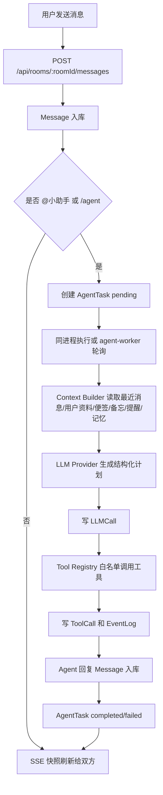

# XOXO Meridian

一个可运行的私密双人聊天室 MVP：Next.js 前后端、PostgreSQL 持久化、Prisma 数据模型、SSE 实时刷新，以及部署在同一台服务器上的本地 Agent Runtime。

## 1. 整体架构

项目采用三层结构：

- Web 前端：登录页、聊天室、左侧快捷工具、右侧生活面板、Agent 状态与执行链路展示。
- Web 后端：Next.js App Router API，负责 demo 认证、房间权限、消息落库、SSE 快照、AgentTask 创建与查询。
- 本地 Agent Runtime：同项目模块化实现，可由 API 同进程执行，也可由 `agent-worker` 独立轮询数据库任务队列执行。

MVP 默认支持两种执行模式：

- 本地开发：`AGENT_TASK_INLINE_RUN=true` 时，用户发给 `@小助手` 的消息会在 API 请求内直接执行 Agent。
- Docker Compose：Web 只写入 `AgentTask`，`agent-worker` 容器轮询 pending 任务并执行，更接近真实本地 Agent Runtime。

## 2. 目录结构

```text
.
├── app
│   ├── api
│   │   ├── agent
│   │   ├── auth/demo-login
│   │   └── rooms/[roomId]
│   ├── chat/page.tsx
│   ├── globals.css
│   ├── layout.tsx
│   └── page.tsx
├── agent
│   ├── agent-runtime.ts
│   ├── agent-worker.ts
│   ├── context-builder.ts
│   ├── execution-tracer.ts
│   ├── llm-provider.ts
│   ├── memory.ts
│   ├── task-dispatcher.ts
│   ├── task-runner.ts
│   ├── tool-registry.ts
│   ├── tools
│   │   ├── memo-tool.ts
│   │   ├── note-tool.ts
│   │   ├── reminder-tool.ts
│   │   ├── timezone-tool.ts
│   │   └── weather-tool.ts
│   └── types.ts
├── components
│   ├── LoginForm.tsx
│   └── chat
├── lib
│   ├── access.ts
│   ├── agent-detection.ts
│   ├── api.ts
│   ├── auth.ts
│   ├── messages.ts
│   ├── prisma.ts
│   └── room-snapshot.ts
├── prisma
│   ├── migrations/202604280001_init/migration.sql
│   ├── schema.prisma
│   └── seed.ts
├── tests
│   ├── agent/agent-runtime.test.ts
│   └── server/auth.test.ts
├── docker-compose.yml
├── Dockerfile
└── package.json
```

## 3. Prisma Schema

核心模型位于 `prisma/schema.prisma`：

- 用户与房间：`User`、`UserProfile`、`Room`、`RoomParticipant`
- 聊天：`Message`
- Agent：`Agent`、`AgentTask`
- 追踪：`ToolCall`、`LLMCall`、`EventLog`
- 生活数据：`Memo`、`Note`、`Reminder`
- 上下文与记忆：`MessageSummary`、`Memory`

消息字段包含 `senderType`、`targetType`、`status`、`metadata`；AgentTask 包含 `pending/running/completed/failed` 状态和 source/final message 关系；所有工具调用与 LLM 调用都会写入可追踪记录。

## 4. 数据流



## 5. API

已实现：

```text
POST /api/auth/demo-login

GET  /api/rooms/:roomId/messages
POST /api/rooms/:roomId/messages
GET  /api/rooms/:roomId/stream

GET  /api/rooms/:roomId/notes
POST /api/rooms/:roomId/notes
GET  /api/rooms/:roomId/memos
POST /api/rooms/:roomId/memos
GET  /api/rooms/:roomId/reminders
POST /api/rooms/:roomId/reminders

POST /api/agent/dispatch
GET  /api/agent/status
GET  /api/agent/tasks/:taskId
POST /api/agent/tasks/:taskId/run
GET  /api/agent/tasks/:taskId/trace
```

## 6. 本地运行

1. 安装依赖：

```bash
npm install
```

2. 准备环境变量：

```bash
cp .env.example .env
```

3. 启动 PostgreSQL，或直接使用 Docker Compose 的数据库：

```bash
docker compose up -d postgres
```

4. 迁移并初始化数据：

```bash
npm run db:deploy
npm run db:seed
```

开发阶段也可以使用：

```bash
npm run db:push
npm run db:seed
```

5. 启动 Web：

```bash
npm run dev
```

访问 `http://localhost:3000`，分别以“我”和“她”登录。可以打开两个浏览器或一个普通窗口加一个隐身窗口。

## 7. Docker Compose 部署

```bash
docker compose up --build
```

Compose 包含：

- `postgres`：PostgreSQL 16
- `web`：Next.js Web + API
- `agent-worker`：本地 Agent Runtime worker，轮询 `AgentTask`

Docker 模式中 Web 设置 `AGENT_TASK_INLINE_RUN=false`，Agent 任务由 worker 执行。

## 8. 配置 LLM

`.env` 示例：

```env
LLM_PROVIDER=openai-compatible
LLM_API_KEY=your_api_key
LLM_BASE_URL=https://api.openai.com/v1
LLM_MODEL=gpt-4.1-mini
```

如果 `LLM_API_KEY` 为空，系统会使用 `mock-local-planner`，仍然会写入 `LLMCall`，方便无 Key 跑通 Demo。

## 9. 替换天气 API

当前 `agent/tools/weather-tool.ts` 默认使用 mock adapter。要接真实 API：

```env
WEATHER_PROVIDER=your-provider
WEATHER_API_KEY=your_weather_key
WEATHER_BASE_URL=https://example.com/weather
```

然后在 `weather-tool.ts` 中把返回结构映射为统一输出即可。工具仍然必须通过 `ToolRegistry` 注册后才能被 Agent 调用。

## 10. Demo 验收流程

1. 运行 seed 后访问首页。
2. 以“我”登录，打开聊天室。
3. 另一个浏览器以“她”登录，同一个房间会通过 SSE 看到消息。
4. “我”发送：`@小助手 明天提醒我给她发早安`
5. 系统创建 `Message` 和 `AgentTask`。
6. Agent Runtime 构建上下文、调用 LLM Provider、调用 `reminder.create`。
7. 数据库中会出现 `ToolCall`、`LLMCall`、`EventLog`。
8. 聊天室出现 Agent 回复，右侧提醒事项出现该提醒。

## 11. 扩展新的 Agent

1. 在 `Agent` 表新增一条 agent，例如 `travel-assistant`。
2. 在 `agent/agent-runtime.ts` 中根据 `task.agentId` 或 `agent.slug` 加载不同系统提示、工具集合和回复渲染策略。
3. 保持 `AgentTask`、`ToolCall`、`LLMCall`、`EventLog` 不变，方便统一追踪。

## 12. 扩展新的 Tool

1. 在 `agent/tools` 新建工具文件，实现：

```ts
export interface AgentTool<Input = unknown, Output = unknown> {
  name: string;
  description: string;
  schema: unknown;
  execute(input: Input, context: ToolExecutionContext): Promise<Output>;
}
```

2. 在 `agent/tool-registry.ts` 中注册。
3. 在 LLM system prompt 或 planner 说明里加入新工具名。
4. 工具不要直接暴露任意命令执行能力；高风险工具需要权限模型、审计和确认机制。

## 13. 从同进程升级到独立 Worker

当前已经保留数据库任务队列：

- Web API 负责创建 `AgentTask`。
- `agent-worker.ts` 轮询 `pending` 任务。
- Web 与 Agent 通过 PostgreSQL 共享状态和执行记录。

升级路径：

1. 在生产环境设置 `AGENT_TASK_INLINE_RUN=false`。
2. 单独启动 `npm run agent:worker`，或使用 Compose 的 `agent-worker` 服务。
3. 后续如需拆成独立本地 HTTP 服务，可让 Web 只写库和调用 `http://localhost:PORT/tasks/:id/run`，Agent 服务内部继续复用 `agent-runtime.ts`。

## 14. 未来扩展方向

- 正式认证：邮箱密码、邀请码、Passkey 或 OAuth。
- WebSocket：替换 SSE 快照为增量事件推送。
- 通知系统：Reminder 到期后推送邮件、短信、移动端通知或站内提醒。
- 上下文压缩：定期生成 `MessageSummary`，把长期偏好写入 `Memory`。
- 多 Agent 编排：按 Agent 能力选择工具集合与 planner。
- 权限沙箱：接入文件读写、浏览器自动化、命令执行前增加用户确认、目录白名单和审计策略。

## 15. 上线部署（Docker Compose + Nginx + HTTPS）

### 必填环境变量

启动期 `lib/env.ts` 会用 zod 校验下列变量，缺失或不合法会直接 `process.exit(1)`：

| 变量 | 说明 |
| --- | --- |
| `POSTGRES_PASSWORD` | PostgreSQL 密码，建议 `openssl rand -base64 32` 生成 |
| `SESSION_SECRET` | HMAC 签名 cookie 用，>=32 字节，建议 `openssl rand -base64 48` |
| `DEMO_LOGIN_PASSWORD` | demo-login 共享密码，>=8 字符，登录页两个用户都要它 |
| `APP_BASE_URL` | 对外 HTTPS 域名，CSRF Origin 校验依据 |
| `NEXT_PUBLIC_APP_URL` | 同上，前端可见 |

### 一键部署

```bash
git checkout release/hardening
cp .env.example .env
# 编辑 .env，把所有 __GENERATE/__SET 占位符替换为真实值
docker compose build
docker compose up -d
curl -fsS https://your-domain/api/health
```

`init` 服务会先跑 `prisma migrate deploy && prisma seed`（idempotent upsert），
完成后 `web` 与 `agent-worker` 才启动。

### Nginx 反代 + HTTPS

详见 [`docs/deploy-nginx.md`](docs/deploy-nginx.md)。要点：

- 应用容器只绑定 `127.0.0.1:3000`，外部全部经 Nginx
- `/api/rooms/:id/stream` 必须 `proxy_buffering off`
- `proxy_set_header X-Forwarded-For` 让限流拿到客户端真实 IP
- `client_max_body_size 1m`

### 安全基线一览

- 共享密码 + HMAC 签名 cookie + 7 天过期
- 全部 POST 路由 zod 输入校验 + IP 维度滑动窗口限流
- `middleware.ts` 强制 `Origin === APP_BASE_URL`（CSRF 二次防御）
- HSTS / CSP / X-Frame-Options / Referrer-Policy / Permissions-Policy
- 多阶段 Dockerfile，运行时镜像非 root、`cap_drop: ALL`、`no-new-privileges`
- PostgreSQL 端口不对外，密码不进镜像层
- `/api/health` + compose healthcheck

### 上线 checklist

- [ ] `.env` 5 个必填项已替换
- [ ] `LLM_API_KEY` 已配（否则 Agent 走 mock-local-planner）
- [ ] Nginx 已配置 + 证书生效
- [ ] `curl https://your-domain/api/health` 返回 200
- [ ] 用浏览器以两个账号 + 共享密码 完成 demo 验收（第 10 节）
